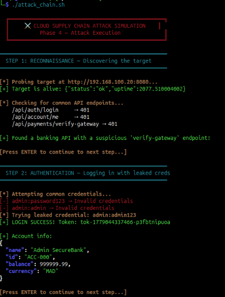
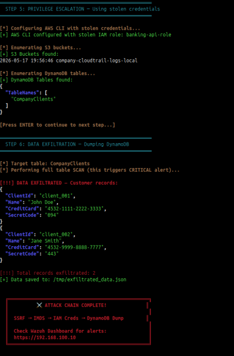
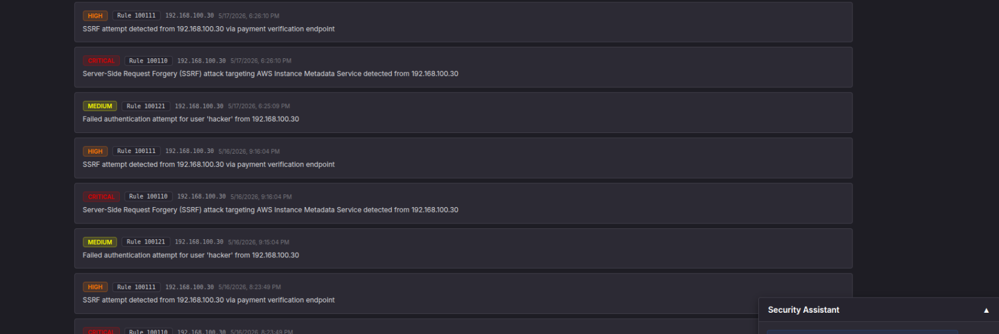

# ☁️🛡️ Cloud Attack Range & Detection

> **A realistic cloud security simulation featuring a multi-VM attack range, SSRF exploitation, and AI-driven threat detection with Wazuh SIEM.**


---

## 📋 Table of Contents

- [Overview](#overview)
- [Architecture](#architecture)
- [Attack Scenario](#attack-scenario)
- [Detection & Response](#detection--response)
- [AI Integration](#ai-integration)
- [Project Structure](#project-structure)
- [Setup & Deployment](#setup--deployment)
- [Screenshots](#screenshots)
- [Technologies Used](#technologies-used)
- [Team](#team)

---

## Overview

This project implements a **complete cloud security simulation** environment for studying and detecting modern cloud-based attacks. It features:

- 🔴 **Red Team:** Automated SSRF attack chain targeting a vulnerable banking application hosted on simulated AWS infrastructure
- 🔵 **Blue Team:** Real-time detection using Wazuh SIEM with 16 custom detection rules mapped to the MITRE ATT&CK framework
- 🤖 **AI Layer:** Google Gemini-powered analysis engine that automatically processes high-severity alerts and generates actionable threat intelligence

The entire environment runs across **3 isolated Virtual Machines** connected via an internal network, simulating a realistic enterprise scenario.

---

## Architecture

The project is distributed across three VMs to simulate a real-world network:

| VM | Role | IP Address | Key Components |
|----|------|-----------|----------------|
| **Kali Linux** | Attacker | `192.168.100.30` | Attack scripts, `curl`, `jq`, AWS CLI |
| **Ubuntu Server** | Cloud Target | `192.168.100.20` | SecureBank API, LocalStack (AWS), Mock IMDS, Wazuh Agent |
| **Ubuntu Server** | SOC / Defense | `192.168.100.10` | Wazuh SIEM, AI Engine, AI Dashboard |

### Data Flow

```
Attacker (Kali) ──SSRF──▶ SecureBank API ──▶ Mock IMDS (steal IAM keys)
                                                    │
                                                    ▼
                                           LocalStack (AWS)
                                           ├── DynamoDB (exfiltrate data)
                                           ├── S3 (create backdoor bucket)
                                           └── IAM (escalate privileges)
                                                    │
                                    CloudTrail Logs + Wazuh Agent
                                                    │
                                                    ▼
                                SOC VM (Wazuh SIEM + AI Engine)
                                           ├── 16 Custom Detection Rules
                                           ├── Gemini AI Analysis
                                           └── AI Insights Dashboard
```

---

## Attack Scenario

The automated attack chain (`attack_chain.sh`) simulates a sophisticated **SSRF-based cloud credential theft**:

| Phase | MITRE ATT&CK | Description |
|-------|--------------|-------------|
| 1. Reconnaissance | T1078 | Brute-force login attempts against SecureBank API |
| 2. Initial Access | T1190 | Authenticate using stolen/weak credentials |
| 3. SSRF Exploitation | T1557 | Exploit the payment verification endpoint to access internal IMDS |
| 4. Credential Theft | T1552.005 | Steal IAM security credentials from the metadata service |
| 5. Discovery | T1580 | Enumerate AWS services (S3, DynamoDB, IAM) |
| 6. Data Exfiltration | T1530 | Download sensitive data from DynamoDB |
| 7. Persistence | T1098 | Create backdoor IAM user and S3 bucket |
| 8. Privilege Escalation | T1078.004 | Attach admin policies to backdoor user |

> All 8 phases are detected by custom Wazuh rules with corresponding MITRE ATT&CK technique IDs.

---

## Detection & Response

### Custom Wazuh Rules (16 Rules)

All alerts are mapped to MITRE ATT&CK tactics and techniques:

```xml
<!-- Example: SSRF Detection Rule -->
<rule id="100110" level="12">
  <decoded_as>json</decoded_as>
  <field name="eventName">SSRF</field>
  <description>SSRF attack targeting AWS Instance Metadata Service</description>
  <mitre><id>T1557</id></mitre>
</rule>
```

| Rule Level | Severity | Count | Examples |
|-----------|----------|-------|---------|
| 12-15 | 🔴 Critical | 5 | SSRF detected, IAM credential theft, privilege escalation |
| 8-11 | 🟡 High | 5 | Suspicious API calls, data exfiltration, backdoor creation |
| 6-7 | 🟠 Medium | 6 | Failed logins, unusual S3 operations, service enumeration |

---

## AI Integration

### AI Analysis Engine (`ai-engine/`)

A Python service that runs every 60 seconds:
1. Polls Wazuh for new alerts with `rule_level ≥ 6`
2. Sends alert context to **Google Gemini** for deep analysis
3. Stores structured results in PostgreSQL:
   - Severity classification
   - AI-generated summary and remediation steps
   - MITRE ATT&CK mapping
   - Threat hunting queries (ready to paste into Wazuh)
   - Indicators of Compromise (IOCs)

### AI Insights Dashboard (`ai-panel/`)

A real-time web dashboard at `http://192.168.100.10:3000`:
- **Dashboard** — Alert overview with severity filtering and time ranges
- **Analytics** — Alert activity breakdown with peak-hour analysis
- **Security Assistant** — AI chatbot for SOC analysts (powered by OpenRouter/Gemma 4 with Gemini fallback)
- **Copy-to-clipboard** — One-click copy of threat hunting queries for Wazuh

---

## Project Structure

```
├── kali-attack/                  # 🔴 Attacker VM scripts
│   ├── attack_chain.sh           #    Full automated attack
│   ├── detection_delay.sh        #    Detection timing test
│   ├── reset_between_runs.sh     #    Cleanup between demos
│   └── setup_kali.sh             #    Kali dependencies setup
│
├── securebank-api/               # ☁️ Vulnerable banking app
│   ├── server.js                 #    Express API with SSRF vuln
│   ├── public/index.html         #    Banking UI
│   └── Dockerfile
│
├── mock-imds/                    # ☁️ Fake AWS metadata service
│   ├── imds_server.py            #    Returns fake IAM credentials
│   └── Dockerfile
│
├── cloudtrail-forwarder/         # ☁️ Log bridge to Wazuh
│   ├── cloudtrail_forwarder.py   #    Polls LocalStack → Wazuh
│   └── Dockerfile
│
├── terraform/                    # ☁️ AWS infrastructure (LocalStack)
│   ├── provider.tf               #    LocalStack provider config
│   ├── dynamodb.tf               #    Customer database tables
│   ├── s3.tf                     #    S3 buckets
│   ├── iam.tf                    #    IAM roles and policies
│   └── cloudtrail.tf             #    CloudTrail logging
│
├── wazuh-rules/                  # 🛡️ Custom detection rules
│   ├── cloudtrail_rules.xml      #    16 custom alert rules
│   ├── cloudtrail_decoders.xml   #    Log decoders
│   └── deploy-rules.sh           #    Auto-deploy script
│
├── ai-engine/                    # 🤖 AI analysis backend
│   ├── ai_engine.py              #    Gemini-powered analyzer
│   ├── requirements.txt
│   └── Dockerfile
│
├── ai-panel/                     # 🤖 SOC dashboard
│   ├── server.py                 #    Flask API + OpenRouter chat
│   ├── public/index.html         #    Dashboard UI
│   ├── requirements.txt
│   └── Dockerfile
│
├── docker-compose.target.yml     # ☁️ Target VM orchestration
├── docker-compose.ai.yml         # 🛡️ SOC VM orchestration
├── install-wazuh-agent.sh        # 🛡️ Wazuh agent installer
└── project-architecture.jpeg     # 📐 Architecture diagram
```

---

## Setup & Deployment

### Prerequisites

- VMware/VirtualBox with 3 VMs on the same network (`192.168.100.0/24`)
- Docker & Docker Compose on Target VM and SOC VM
- Kali Linux with `curl`, `jq`, and `aws` CLI

### 1. Target VM (192.168.100.20)

```bash
# Deploy the vulnerable cloud infrastructure
cd ~/cloud-target
docker compose up -d

# Initialize AWS resources (LocalStack)
cd terraform && terraform init && terraform apply -auto-approve
```

### 2. SOC VM (192.168.100.10)

```bash
# Deploy Wazuh SIEM (using wazuh-docker single-node)
cd ~/wazuh-docker/single-node
docker compose up -d

# Deploy custom detection rules
cd ~/wazuh-rules && bash deploy-rules.sh

# Deploy AI Engine + Dashboard
cd ~/ai-engine
echo "GEMINI_API_KEY=your-key" > .env
echo "OPENROUTER_API_KEY=your-key" >> .env
docker compose up -d --build
```

### 3. Attacker VM (192.168.100.30)

```bash
# Setup tools
cd ~/kali-attack && bash setup_kali.sh

# Launch the attack
bash attack_chain.sh
```

### 4. Monitor

- **Wazuh Dashboard:** `https://192.168.100.10` (admin / SecretPassword)
- **AI Insights Panel:** `http://192.168.100.10:3000`
- **SecureBank App:** `http://192.168.100.20:8080`

---

## Screenshots

### 🏦 SecureBank — Vulnerable Banking Application

| Screenshot | Description |
|-----------|-------------|
|  | Login page with demo accounts |
|  | Account dashboard with transactions |
|  | The vulnerable "Gateway Verification" endpoint (SSRF vector) |

### 🔴 Attack Chain — Kali Linux

| Screenshot | Description |
|-----------|-------------|
|  | Step 1-2: Reconnaissance, brute-force, and successful login |
|  | Step 3-4: SSRF exploitation and IAM credential theft |
|  | Step 5-6: Privilege escalation and DynamoDB data dump |

### 🛡️ Wazuh SIEM — Detection

| Screenshot | Description |
|-----------|-------------|
|  | Wazuh dashboard overview with alert severity summary |
|  | Alert discovery view — 5 critical SSRF alerts detected |
|  | Detailed SSRF alert with source IP, request parameters, and event metadata |

### 🤖 AI Threat Intelligence Dashboard

| Screenshot | Description |
|-----------|-------------|
|  | AI-powered threat analysis with severity-coded alerts |
|  | Expanded alert view with AI analysis, remediation steps, and MITRE ATT&CK mapping |
|  | Analytics: severity distribution, top attacker IPs, MITRE mapping, and activity log |
|  | AI Security Assistant analyzing active threats in real-time |

---


## Technologies Used

| Category | Technologies |
|----------|-------------|
| **SIEM** | Wazuh 4.x (Manager, Indexer, Dashboard) |
| **Cloud Emulation** | LocalStack 3.4, Terraform |
| **AI/ML** | Google Gemini 2.0 Flash, OpenRouter (Gemma 4 31B) |
| **Backend** | Python (Flask), Node.js (Express) |
| **Database** | PostgreSQL 15, OpenSearch (Wazuh Indexer) |
| **Containerization** | Docker, Docker Compose |
| **Attack Tools** | curl, jq, AWS CLI, Bash scripting |
| **Framework** | MITRE ATT&CK |

---

## Team

| Name | Role |
|------|------|
| **Ayman Djioui** | Project Lead, AI Integration & SOC Dashboard |
| **Aymane Elouafi** | Cloud Infrastructure & Attack Simulation |
| **Badr Jakout** | Wazuh SIEM & Detection Rules |
| **Amine Chaker** | SecureBank Application & SSRF Vulnerability |

> 📧 **Supervised by:** Prof. Maleh — ENSA Khouribga

---

## License

This project is for **educational purposes only**. It was developed as part of a cybersecurity course at ENSA Khouribga. The attack techniques demonstrated should only be used in controlled lab environments.
